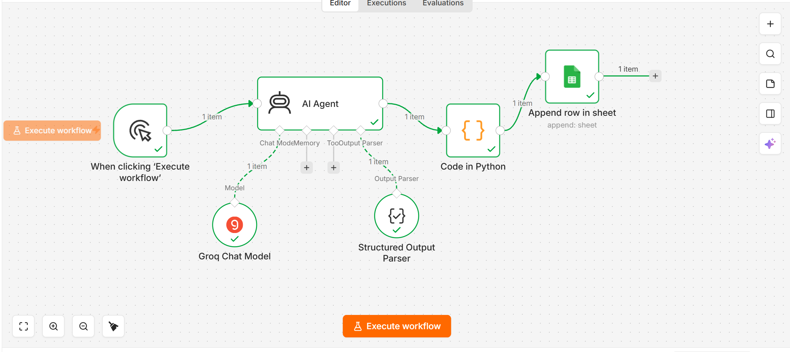

# AI-Powered Temperature Converter Workflow 🤖🌡️

An automated n8n workflow that uses an AI agent to generate random temperature data, processes it via a custom Python script, and automatically logs the results into a Google Sheet.

## 📸 Workflow Architecture

 

*(Zaroori Note: Agar aapne picture ka naam `screenshot.png` ki jagah kuch aur rakha tha, jaise `workflow.jpg`, toh upar wali line ke bracket `()` mein exact wahi naam likh dijiye ga taake picture yahan show ho jaye)*

## ✨ Features
- **AI Agent Generation:** Uses the Groq LLM to generate test temperatures.
- **Structured Output Parsing:** Forces the AI to output strict JSON to prevent hallucinations.
- **Custom Python Processing:** A Python node extracts nested data, applies the `(F - 32) * 5/9` formula, rounds to two decimal places, and structures a clean JSON output.
- **Google Sheets Integration:** Automatically appends the Fahrenheit and calculated Celsius values into designated columns.

## 🛠️ Technologies Used
- **n8n** (Automation & Workflow Mapping)
- **Python** (Data extraction & Math operations)
- **AI / LLM** (Groq, Prompt Engineering)
- **Google Sheets API**

## 🚀 How to Import & Use
1. Download the JSON file from this repository.
2. Open your n8n workspace, click on **Import from File**, and upload the JSON.
3. Authenticate your own credentials for the Groq Chat Model and Google Sheets node.
4. Click **Execute Workflow** and watch the automated data pipeline in action!
